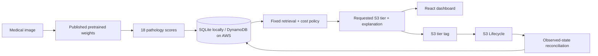

# Smart Storage Tier Recommender for the Medical Sector

CloudTierRecommender is an explainable, end-to-end application that recommends an Amazon S3 storage class for each medical image. It combines pathology scores from published pretrained TorchXRayVision weights with non-identifying metadata and access history, then applies a transparent cost and access-delay policy across Standard, Standard-IA, Glacier Flexible Retrieval, and Deep Archive.

**The active path does not train or fine-tune a model.** It downloads and runs the official `densenet121-res224-all` weights directly. The resulting 18 named pathology scores feed a checked-in, versioned retrieval policy shared by the local backend and both AWS Lambda functions.

The application is complete in local mode and implemented for AWS deployment. AWS credentials are the remaining prerequisite for provisioning and live cloud evidence.

The canonical product description, Mermaid architecture diagrams, contracts, implementation plan, validation record, and deployment checklist are in [architecture/PRODUCT_AND_IMPLEMENTATION.md](architecture/PRODUCT_AND_IMPLEMENTATION.md).

## What is implemented

- React 18 + Vite frontend with local/Cognito login, dashboard, scan browser, detail view, predictions, manual overrides, restore actions, audit history, and cost comparisons.
- Flask + SQLite local API with migrations, validation, filtering, paging, real aggregates, fixed-policy inference, restore simulation, and append-only audit events.
- API Gateway Lambda with Cognito group authorization, DynamoDB state/audit records, S3 tag updates, restore calls, and computed dashboard/cost responses.
- S3 event inference Lambda with safe missing-feature handling, tag preservation, CloudWatch metrics, and scheduled placement/restore reconciliation.
- SAM/CloudFormation stack for private S3 buckets, CloudFront OAC, Cognito, API Gateway, Lambda, DynamoDB, Lifecycle, EventBridge, and SNS.
- Credential-free build scripts, an ingest script, automated tests, and one-command AWS deployment after credentials are configured.

## Architecture



## Run the full application locally

Prerequisites: Python 3.11–3.13 and Node.js 20 or newer.

```powershell
python -m venv .venv
.\.venv\Scripts\Activate.ps1
pip install -r src/backend/requirements.txt
pip install -r src/ml_model/requirements.txt
python src/backend/app.py
```

In another terminal:

```powershell
cd src/frontend
npm ci
npm start
```

Open `http://127.0.0.1:5173`. The local login details are displayed on the sign-in page. The frontend uses the live Flask API by default. Static mock responses require the explicit `VITE_USE_MOCK_API=true` setting.

## Run inference directly from published weights

```powershell
python src/ml_model/extract_pretrained_features.py path\to\xray.png --output temp\features.json
python src/ml_model/predict.py --features temp\features.json --size-bytes 15728640
```

The first command downloads the published TorchXRayVision checkpoint to its normal cache. It records the source SHA-256 and model name in the output JSON. `src/ml_model/train.py` exits deliberately; the earlier experiment is retained in `legacy_training.py` only for history.

## Test and build

```powershell
python -m unittest discover -s tests -p "test_*.py" -v
python aws/lambda/api_handler/build_package.py
python aws/lambda/tier_inference/build_package.py
cd src/frontend
npm ci
npm run build
npm audit
```

The verified state on 21 September 2026 is 16 passing Python tests, a successful production frontend build, zero npm audit findings, successful Lambda bundles, a clean `cfn-lint` result, successful published-weight extraction, and a complete browser smoke test against the live local API.

## Deploy when AWS credentials are available

Configure the AWS CLI through a profile, SSO, or temporary environment session. Do not place keys in this repository or the frontend.

```powershell
.\aws\deploy.ps1 -Region us-east-1 -StackName smart-storage-tier -NotificationEmail you@example.com
```

The script packages and deploys the stack, derives frontend settings from CloudFormation outputs, builds the Vite app, publishes `dist/` to the private frontend bucket, and invalidates CloudFront. Create Cognito users/groups and ingest a small public fixture afterward. See [aws/README.md](aws/README.md) for the exact workflow.

## Repository structure

| Path | Purpose |
| --- | --- |
| [architecture/](architecture/) | Canonical architecture, implementation plan, and decision records |
| [src/ml_model/](src/ml_model/) | Pretrained extraction and the shared inference-only policy |
| [src/backend/](src/backend/) | Local Flask/SQLite API |
| [src/frontend/](src/frontend/) | React/Vite application |
| [aws/](aws/) | SAM stack, Lambdas, ingest, IAM references, and deployment |
| [tests/](tests/) | Policy, local API, cloud API, and Lambda tests |
| [dataset/](dataset/) | Dataset scripts and ignored local data |
| [results/](results/) | Historical prototype outputs; not clinical evidence |

## Current limitations

- Retrieval scoring coefficients and access-delay penalties are transparent engineering assumptions, not clinically calibrated parameters.
- Historical result files do not establish medical validity and should not be used as headline evidence.
- A live AWS transition can take time because S3 Lifecycle is asynchronous and Standard-IA has a 30-day transition constraint.
- Real hospital integration, DICOM governance, production observability, and clinical validation are outside this course prototype.

## Team

| Name | Reg No | Branch | Primary ownership |
| --- | --- | --- | --- |
| Pratyush Chandrasekhar | 24BIT0226 | `feature/student1` | Frontend, testing, CloudFront |
| Subhrojyoti Das | 24BIT0194 | `feature/student2` | Backend, database, auth, infrastructure |
| Mehul Anand | 24BIT0185 | `feature/student3` | Dataset, inference, S3, metrics |

Project Phase-I · BCSE355L Cloud Architecture Design · 2026 · Instructor: Dr. Priya V

## License

MIT — see [LICENSE](LICENSE).
