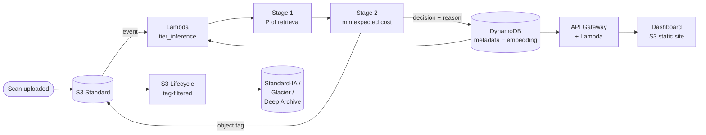

# Smart Storage Tier Recommender for the Medical Sector

**AI-Based Storage Tier Recommendation for Medical Image Repositories using Deep Learning Analytics**

Project Phase-I · BCSE355L Cloud Architecture Design · 2026
Course Instructor: Dr. Priya V

Detailed product description, current implementation review, architecture diagrams, and delivery
plan: [`architecture/PRODUCT_AND_IMPLEMENTATION.md`](architecture/PRODUCT_AND_IMPLEMENTATION.md)
(reviewed 21 September 2026).

---

## 1. What this project does

Hospitals generate an enormous volume of medical scans (CT, MRI, X-ray). Keeping every scan on
fast storage is expensive. Moving everything to cheap storage is also wrong, because retrieving a
file from deep archive can take hours, and a doctor cannot wait that long.

Amazon S3 offers several storage classes at very different price and speed points — S3 Standard is
fast but costly, Glacier Deep Archive is cheap but slow. **This project uses deep learning to decide
which storage class each individual scan belongs in.**

The decision is driven by three kinds of signal:

| Signal | Source | Why it matters |
| --- | --- | --- |
| Image content | Deep learning model over the scan itself | A scan showing an active finding is far likelier to be retrieved |
| DICOM metadata | Modality, body part, patient age, study description | Available at ingest, costs nothing to read, works before any access history exists |
| Access history | Past retrieval record for that study | How existing storage systems decide today |

### What makes this different

Existing storage-tiering research (Harmonia, Sibyl) is accurate and extremely fast, but judges a
file purely on block-level behaviour — request size, access count, access interval. It has never
been applied to medical data. Meanwhile medical imaging platforms (Kaapana, PARADIM) have rich
DICOM indexes and deep learning pipelines, but use them only to help the radiologist, never to
manage the storage underneath.

**Nobody has joined the two.** That is the gap this project fills. See
[`docs/`](docs/) for the full literature survey and research gap analysis.

---

## 2. System architecture

Full design, diagrams and rationale: [`architecture/README.md`](architecture/README.md).
Decision log with rejected alternatives: [`architecture/decisions.md`](architecture/decisions.md).

### In one paragraph

A scan lands in S3 Standard. An S3 event triggers a Lambda, which pulls that scan's features from
DynamoDB — metadata plus a precomputed image embedding — and predicts the probability the scan will
be retrieved again. A cost rule converts that probability into the storage class with the lowest
expected total cost, weighting a wrongly archived scan far more heavily than a slightly higher bill.
The Lambda writes the chosen class as an S3 object tag; a tag-filtered Lifecycle rule performs the
actual transition. Every decision and its reason is written to DynamoDB, so the dashboard can
explain *why* a scan ended up where it did.



### Key decisions

| Decision | Rationale |
| --- | --- |
| **Serverless only — no EC2, no RDS** | AWS changed the Free Tier on 15 July 2025. Lambda, DynamoDB and CloudFront keep always-free allowances that never expire; EC2 does not. Zero idle cost means nothing can quietly drain the credits. |
| **Image embeddings precomputed offline** | Image content never changes, so recomputing it per request is waste. Keeps the Lambda package small and puts the heavy work on Colab's free GPU. |
| **Tag-based Lifecycle rules, not direct API calls** | The model decides policy; AWS enforces mechanism. Auditable, retried by AWS, and visible in the console during the demo. |
| **Two-stage model, not a four-class classifier** | Stage 1 learns a probability; Stage 2 is an explicit cost rule. Decisions become explainable, and the clinical penalty can be re-tuned without retraining. |
| **NIH ChestX-ray14** | The only dataset needing no clearance of any kind. Label derived from the `Follow-up #` column. |
| **Two-track evaluation** | Cost projected over all 112,120 records offline for the headline result; mechanism proven live on ~1,000 images inside the free allowance. |

### Why the two-stage model matters

A standard classifier treats every mistake as equally bad. Here they are not:

- A rarely-used scan left in Standard → we overpay slightly. **Minor.**
- A scan the doctor needs sent to Deep Archive → they wait up to 12 hours. **Serious.**

Our research gap analysis argues that existing systems fail precisely because they treat all errors
as equal. A symmetric classifier would reproduce the flaw we are criticising, so the asymmetry lives
in an explicit, inspectable cost rule instead of being buried in a loss function.

### Still open

- [ ] Confirm AWS account creation date — decides which free-tier regime applies
- [ ] DynamoDB partition key design
- [ ] API contract between frontend and backend
- [ ] Clinical penalty values and sensitivity sweep range
- [ ] Whether the rubric requires EC2 or a relational database for marks

Tracked in [`architecture/decisions.md`](architecture/decisions.md#open-decisions).

---

## 3. Repository structure

| Path | Contents |
| --- | --- |
| [`docs/`](docs/) | All written deliverables — report, literature survey, research gap, objectives, novelty |
| [`architecture/`](architecture/) | System, AWS and workflow diagrams, plus the source files used to draw them |
| [`dataset/`](dataset/) | Raw data, processed data, and the dataset documentation. **No large or patient-identifiable files are committed.** |
| [`src/frontend/`](src/frontend/) | User interface |
| [`src/backend/`](src/backend/) | API layer, database integration, authentication |
| [`src/ml_model/`](src/ml_model/) | Preprocessing, training, inference, evaluation |
| [`aws/`](aws/) | Cloud infrastructure configuration and service definitions |
| [`results/`](results/) | Experiment outputs, metrics, graphs, execution screenshots |
| [`presentation/`](presentation/) | Review slides and demo material |

Every folder has its own `README.md` describing exactly what belongs in it and who owns it.

---

## 4. Branching strategy

```
main                    production / tagged releases only
 └── develop            integration branch — all work merges here first
      ├── feature/student1
      ├── feature/student2
      └── feature/student3
```

### Rules

1. `main` and `develop` are never committed to directly. All work happens on a feature branch.
2. Each member works **exclusively** inside their own `feature/studentX` branch.
3. Commit regularly and in small, meaningful units — not one giant commit at the end.
4. Raise a Pull Request from `feature/studentX` into `develop`.
5. At least one teammate reviews the PR before it is merged. Resolve conflicts on the feature branch.
6. Once the system is stable, `develop` merges into `main` and the release is tagged
   (e.g. `v1.0-Phase1`).

### Per-member expectations

Each team member must be able to show, at review:

- 20–30 meaningful commits
- At least 2 Pull Requests
- Active participation in reviewing others' PRs
- A consistent weekly commit history — not a single burst before the deadline
- Documentation updated alongside code

Every member must also be ready to individually explain their own commits and the specific
AWS services they integrated.

---

## 5. Team

| Name | Reg No | Branch | Primary ownership | AWS services |
| --- | --- | --- | --- | --- |
| **Pratyush Chandrasekhar** | 24BIT0226 | `feature/student1` | Frontend, testing, papers 1–5 | S3 static hosting, CloudFront, CloudWatch dashboards |
| **Subhrojyoti Das** | 24BIT0194 | `feature/student2` | Backend, database, auth, infrastructure, papers 6–10 | API Gateway, Lambda (API), DynamoDB, IAM, S3 Lifecycle |
| **Mehul Anand** | 24BIT0185 | `feature/student3` | Dataset, ML model, results, papers 11–15 | Lambda (inference), S3 image store, CloudWatch metrics |

Branch names stay as `feature/studentN` because the course guidelines specify that exact structure.
The mapping above is the authoritative record of who owns which branch.

All three members contribute to the literature survey, research gap analysis, AWS services,
documentation and presentation.

---

## 6. Getting started

```bash
git clone https://github.com/SUBHRO71/SmartStorageTierRecommenderForMedicalSector_Cloud_Project_2026.git
```

```bash
git checkout develop && git checkout -b feature/studentX
```

Setup instructions for each component live in that component's own README —
see [`src/backend/`](src/backend/), [`src/ml_model/`](src/ml_model/) and [`src/frontend/`](src/frontend/).

The active intelligence path is inference-only. It uses published TorchXRayVision chest X-ray
weights and a versioned, checked-in retrieval policy; it does not train or fine-tune a model:

```bash
pip install -r src/ml_model/requirements.txt
python src/ml_model/extract_pretrained_features.py path/to/xray.png --output features.json
python -m unittest discover -s tests -p "test_*.py" -v
```

AWS credentials are not needed to build or test this path. The Lambda will use its execution role
when deployed later.

---

## 7. Current status

| Item | State |
| --- | --- |
| Literature survey (15 papers across the team) | Done |
| Research gap analysis | Done |
| Repository structure | Done |
| System architecture | Done — see [`architecture/`](architecture/) |
| Dataset selection | Done — NIH ChestX-ray14 |
| Implementation | In progress: inference-only pretrained feature extraction, shared decision policy, local API integration, and credential-free Lambda packaging are implemented. AWS deployment and end-to-end validation remain; see the [implementation review](architecture/PRODUCT_AND_IMPLEMENTATION.md). |

### Build order

| Phase | Work | Done when |
| --- | --- | --- |
| 0 | Check AWS account date. **Set a $1 Budget alarm before creating anything else.** Install LocalStack for free local development | Alarm confirmed |
| 1 | Download subset, build features and label, split by `Patient ID` | `features.csv` reproducible from `raw/` |
| 2 | Run published pretrained chest X-ray weights and apply the versioned retrieval policy | Feature provenance recorded; no local model training required |
| 3 | Build the offline cost model — **this produces the headline result** | Cost table vs. all three baselines |
| 4 | Deploy: S3 + Lambda + DynamoDB + tagged Lifecycle | A real transition visible in the console |
| 5 | API and dashboard | Live demo runs end to end |
| 6 | Sensitivity sweep on the clinical penalty | Graph ready for the deck |

Phase 3 is where the project's value is. Phases 4–5 prove it is real. Do not let AWS plumbing eat
the time that belongs to phase 3.

---

## 8. Licence

MIT — see [`LICENSE`](LICENSE).
