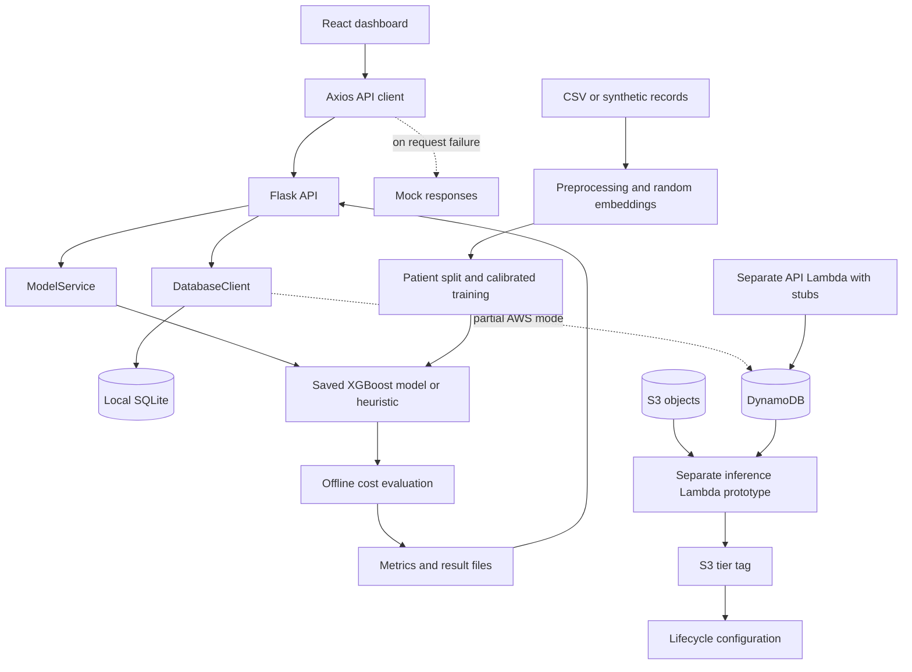
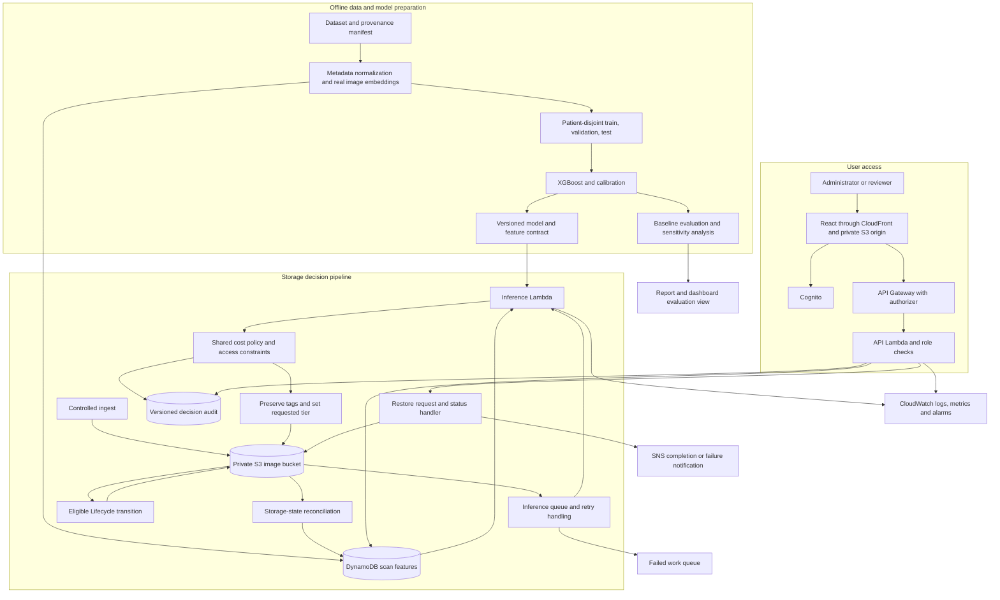

# CloudTierRecommender

## Product description

**CloudTierRecommender is an explainable storage decision system for medical image repositories.** It aims to reduce the cost of retaining scans by recommending an Amazon S3 storage class for each object, while accounting for the consequences of delaying access to a scan that is needed again.

The full project title is **Smart Storage Tier Recommender for the Medical Sector**, developed for Project Phase-I, BCSE355L Cloud Architecture Design, 2026, under Dr. Priya V. The local repository is named `CloudTierRecommender`; this name is used for the Obsidian project folder.

A medical archive contains studies with different access patterns. Some images will be needed repeatedly for comparisons or follow-up, while others will remain untouched for a long time. Keeping every image in immediately accessible storage can waste money. Archiving indiscriminately can create retrieval delays. The product makes this tradeoff visible and measurable rather than hiding it behind a single classification label.

The intended system combines image-derived features, metadata available at ingest, and access history when available. A calibrated model estimates retrieval probability. An explicit policy evaluates candidate storage classes and chooses the lowest expected cost subject to access requirements. An operator can inspect the probability, assumptions, alternatives, and reason for a recommendation before relying on it.

The four initial candidates are S3 Standard, Standard-IA, Glacier Flexible Retrieval, and Glacier Deep Archive. The implementation uses `STANDARD`, `STANDARD_IA`, `GLACIER`, and `DEEP_ARCHIVE` as AWS-facing names. `GLACIER` here does not mean Glacier Instant Retrieval.

### Product promise and research hypothesis

The product promise is an auditable answer to three questions: **where should this scan be stored, why, and what cost/access tradeoff does that imply?** The research hypothesis is that image content and medical metadata add predictive value beyond simple age or access-history rules, particularly when a new image has little history.

This hypothesis remains to be demonstrated. The repository's broad novelty statements should be treated as the team's research positioning, not as proof that no prior work exists. Likewise, the current implementation does not establish a clinically validated retrieval prediction system.

### Users and jobs

| User | Job | Product behavior |
| --- | --- | --- |
| Archive administrator | Control storage placement and investigate exceptions | Browse objects, inspect decisions, request overrides, follow transition status |
| Radiology reviewer | Understand availability of a prior study | See actual storage state, expected retrieval workflow, and restore progress |
| Cloud operator | Keep the pipeline reliable and accountable | Monitor failures, retry work, inspect audit records, track spend |
| Researcher or course evaluator | Assess whether the approach works | Reproduce experiments, compare baselines, inspect limitations and ablations |

### Main user journeys

1. **Review the archive:** sign in, open the dashboard, examine tier distribution and cost estimates, then filter the scan browser to investigate individual objects. Every aggregate should identify its dataset, time horizon, and whether it is simulated or measured.
2. **Explain a recommendation:** open a scan, inspect available metadata and feature quality, review retrieval probability, compare cost components for all eligible tiers, and read the policy explanation.
3. **Request an override:** an authorized administrator selects a tier and supplies a reason. The system records the request and shows it as pending until the storage operation is confirmed. A database edit alone must not imply the object has moved.
4. **Retrieve an archived scan:** request restoration, show progress, notify the requester on completion, and record the access event for later policy evaluation. This workflow is planned, not implemented end to end.
5. **Evaluate the model:** run a reproducible experiment, compare monetary cost and access-delay outcomes, and export evidence for the report. A demo dataset must remain visibly distinct from an evaluation dataset.

### Scope and boundaries

The MVP covers public or synthetic research data, offline feature preparation, probability estimation, an explicit cost policy, a local dashboard/API, and a small AWS mechanism demonstration. It is a storage research prototype, not a diagnostic model or a replacement for a PACS viewer. Real hospital integration, production access controls, clinical validation, and operational service commitments are later work.

The proposed design uses serverless AWS services and local/Colab training. SQLite is a development convenience; DynamoDB is the intended cloud metadata store. Serverless reduces continuously running compute, but stored data and other services can still incur charges. Free-tier eligibility and remaining credits must be checked against the actual account rather than inferred from old README statements.

## Review basis and current status

This document was prepared from the root and component READMEs, architecture notes and decision records, repository structure, application source, AWS configuration, and saved result artifacts on **21 September 2026**. Report PDFs were inventoried but not independently re-reviewed. No AWS deployment was executed during this review.

The root README says implementation has not started. That is stale: substantial prototype code exists. Presence of source code is distinguished below from runtime verification and deployed behavior.

| Area | Observed implementation | Remaining boundary |
| --- | --- | --- |
| Frontend | React 18, React Router, Axios, Recharts, Tailwind; login, dashboard, browser, detail, cost pages | No build verified in this review; request failures silently return mock data |
| Authentication | Amplify/Cognito client integration and local mock login | Server authorization and enforced roles are not established |
| Local backend | Flask routes, SQLite seed data, model-service adapter | Placeholder aggregate values, implicit fallbacks, incomplete input validation |
| Cloud database | DynamoDB reads and updates | Pagination incomplete; summary implementation still opens SQLite |
| ML | Patient-grouped splits, XGBoost, isotonic calibration, evaluation scripts | Image vectors are random; no actual CNN extractor is present |
| Cost policy | Explicit expected-cost functions | Three implementations disagree on horizon, terms, and defaults |
| AWS inference | Reads metadata, tags S3 objects, updates DynamoDB, emits metrics | Artifact and feature contracts differ from training; fallback probability masks failures |
| AWS API | Routing and basic reads/updates | Prediction, dashboard, and cost responses contain stubs |
| Infrastructure | Lifecycle, IAM, Cognito, SNS JSON examples | No complete repeatable stack, integration proof, or restore pipeline found |
| Evidence | Metrics JSON, cost CSV/chart, experiment plots | Results lack a complete provenance manifest and do not substantiate the product hypothesis |

### What the saved results actually show

`results/latest_metrics.json` records 560 training samples, 127 test samples, ROC AUC **0.4880**, and Brier score **0.2607**. `results/evaluation_summary.json` records all 127 evaluated objects in Standard-IA, a modeled cost of approximately **0.4462**, all-Standard cost of **0.5258**, a reported **15.14%** reduction, and **0%** wrongly archived.

These are saved prototype outputs, not independently reproduced results. AUC is near chance. Zero wrongly archived is unsurprising when no object is assigned to an archive tier. The cost calculation includes a configurable access-delay penalty, so its total must not be presented as an actual AWS bill. There is no result manifest proving that these outputs came from authentic NIH images, and preprocessing can generate synthetic records automatically. These files are useful as a pipeline checkpoint, not as headline evidence of successful deep learning.

## Repository map

```text
CloudTierRecommender/
├── README.md                     Project overview, team, workflow
├── architecture/
│   ├── README.md                 Original logical and AWS designs
│   ├── decisions.md              Architecture decision records
│   ├── make_diagrams.py          Report diagram generator
│   └── PRODUCT_AND_IMPLEMENTATION.md  This review and delivery plan
├── aws/
│   ├── lambda/api_handler/       Cloud API prototype
│   ├── lambda/tier_inference/    S3-event inference prototype
│   ├── iam_policies/             Service permission templates
│   ├── cognito_config.json       Identity configuration example
│   ├── sns_config.json           Notification configuration example
│   ├── s3_lifecycle.json          Tag-filtered transition rules
│   └── cost_estimates.md          Existing cost assumptions
├── dataset/
│   ├── raw/                      Downloader; local data excluded from Git
│   └── processed/                Generated features and splits, excluded
├── src/
│   ├── frontend/
│   │   ├── public/               HTML entry
│   │   └── src/                  Pages, components, API client, auth
│   ├── backend/                  Flask API, database adapter, model adapter
│   └── ml_model/                 Preprocess, train, predict, evaluate, config
├── results/                      Saved metrics, tables, charts; weights excluded
├── docs/                         Report PDFs and report-generation scripts
└── presentation/                 Presentation guidance and future demo assets
```

Keep this structure. Add shared contracts and common inference/policy code as the implementation converges; avoid rewriting the application merely to impose a new layout. The Obsidian copy of this document is self-contained. Repository paths in backticks are source references, not links that depend on the vault's location.

## Architecture diagrams

### Current prototype architecture

Solid arrows describe code paths present in the checkout. Separate cloud nodes do not imply a verified deployment.



### Target architecture

This is the proposed integrated architecture. Queued retries, reconciliation, restore handling, and shared packaging are implementation work, not claims about current capabilities.



The model recommends; policy constrains; S3 performs eligible transitions; reconciliation confirms actual state. Training runs offline so the online service does not need to execute a large image network for each recommendation. Images remain in S3, while metadata, feature references, and decisions remain queryable independently.

### Target ingest and decision sequence

```mermaid
sequenceDiagram
    autonumber
    participant I as Ingest service
    participant D as Feature store
    participant S as S3
    participant Q as Work queue
    participant L as Inference worker
    participant A as Decision audit
    participant R as Reconciler
    I->>D: Register stable scan ID and feature readiness
    I->>S: Upload object using registered identity
    S-->>Q: Object-created event
    Q->>L: Deliver versioned object event
    L->>D: Fetch features and policy constraints
    alt Features missing or incompatible
        L->>D: Record blocked decision; retain Standard
        L-->>Q: Retry or route to failed work queue
    else Features ready
        L->>L: Validate schema, infer probability, evaluate eligible tiers
        L->>A: Record versioned recommendation
        L->>S: Merge tier tag with existing tags
        L->>D: Store requested tier and pending status
        Note over S: Lifecycle applies eligible transition asynchronously
        R->>S: Inspect actual storage class
        R->>D: Update observed tier and confirmation timestamp
    end
```

## Component responsibilities and contracts

### Frontend

Keep the existing page structure: login, dashboard, scan browser, scan detail, and cost comparison. The dashboard should separate observed storage distribution from recommendation distribution. Detail should show requested tier, observed tier, transition status, model version, and explanation. Cost comparisons should state horizon, currency, dataset, sample count, assumptions, and run ID.

Mock mode must be an explicit development setting with a visible indicator. A failed production request must produce an error state, especially for mutations; it must not become a successful mock override. Handle loading, empty results, expired login, denied actions, and retryable failures distinctly.

### API and authorization

The Flask implementation is the local adapter. API Gateway/Lambda is the target cloud adapter. They should invoke the same application services and share response contracts rather than implement different prediction and cost logic.

| Endpoint | Present behavior | Target contract |
| --- | --- | --- |
| `GET /api/health` | Local mode/model status | Report readiness and explicit execution mode without sensitive details |
| `GET /api/scans` | Local pagination; limited DynamoDB scan | Bounded limit, documented filtering, opaque continuation token |
| `GET /api/scans/{id}` | Metadata and local computed costs | Stable identity, feature status, latest decision, actual storage state |
| `POST /api/scans/{id}/predict` | Local prediction; cloud stub | Versioned decision with probability, policy costs, and status |
| `POST /api/scans/{id}/tier` | Database-only mutation | Authorized override request with reason, request ID, pending state |
| `GET /api/costs` | Mixed saved and placeholder values | One evaluation artifact with provenance and separate cost categories |
| `GET /api/dashboard/summary` | Mixed aggregates and constants | Source-backed counts with freshness and measurement scope |
| `POST /api/scans/{id}/restore` | Missing | Idempotent restore request; return job ID and accepted status |
| `GET /api/scans/{id}/restore` | Missing | Pending, available-until, complete, or failed state |

Use consistent JSON errors with code, message, and request ID. Validate tier enums, IDs, positive limits, maximum page size, and request bodies. Use 400 for invalid input, 401/403 for identity/permission failures, 404 for unknown objects, and an explicit unavailable response for missing required model/features. Proposed roles are viewer, archive administrator, and operator; map them to actual Cognito groups and enforce them on the server.

### Data model

| Record | Required fields | Purpose |
| --- | --- | --- |
| Scan | `scan_id`, bucket, complete object key, object version, bytes, metadata, feature status | Unambiguous object identity and ingest state |
| Feature manifest | schema version, ordered feature names, embedding version, dimensions, source checksum | Training/inference compatibility |
| Decision | decision ID, scan ID, time, probability, model/policy/price versions, eligible tiers, cost components, reason | Reproduce and explain recommendations |
| Placement | requested tier, observed tier, status, last confirmation, override expiry | Separate intent from physical storage state |
| Access/restore event | event ID, scan ID, request time, completion time, outcome | Measure retrieval and restore behavior |
| Evaluation run | dataset origin, split IDs, seed, code revision, configuration, metrics | Trace every published result |

The prototype uses `scan_id` as a key. Keep a stable opaque scan identity and store the complete S3 location separately: stripping extensions or taking only a basename can collide and already disagrees with local seeded IDs. Design indexes from access patterns such as scan lookup and tier/status listing. Store decisions append-only with a latest-decision reference; do not overwrite the only audit record. Use supported numeric representations for DynamoDB, with deliberate JSON serialization.

### Model and feature pipeline

The current learned estimator is calibrated **XGBoost**. The planned deep learning contribution is image embedding extraction; it does not exist yet. `preprocessing.py` unconditionally generates random 128-dimensional vectors, while `model_service.py` supplies zeros for those columns. The inference Lambda constructs only two metadata values plus ten embedding values and attempts to call a different artifact interface. These paths need one shared feature builder and loader.

The current label is derived by checking whether a patient's follow-up number is below their maximum. It indicates that a later study exists, not that this particular image was accessed. Absence of another observed study is also not proof of permanent non-retrieval. The dataset does not supply the timestamps or access logs needed to validate a fixed retrieval horizon. Present proxy-label experiments as such, and reserve claims about actual retrieval for a future trace-backed study.

Split by patient before fitting transformations. Preserve a fixed feature order, training-only preprocessing parameters, and calibration set. Define how 128 dimensions are obtained from the chosen CNN, including any learned projection. Record image preprocessing, weights, embedding dimensions, checksums, and missing-image behavior. Missing required features should block autonomous archival rather than silently inventing values.

### Cost and placement policy

The decision objective should be explicit:

```text
score(tier) = expected monetary cost(tier, size, horizon, access assumptions)
            + access-delay penalty(tier, probability, policy)
chosen tier = lowest-score tier among tiers allowed by access constraints
```

Monetary components include storage, transitions, retrieval requests and bytes, metadata overhead, minimum-duration effects, restored-copy storage, and relevant service overhead. The access-delay penalty is a modeling preference, not an AWS invoice item. Report it separately. If multiple accesses per object matter, a probability of at least one access alone is insufficient; introduce an expected access count or an explicit single-access assumption.

Use one implementation for offline evaluation, Flask, and Lambda. Fix size units and horizon semantics; current local/evaluation paths generally use 12 months, while Lambda calculates monthly storage with the same penalty constants. Define hard eligibility rules for pinned-hot objects, unavailable features, or required retrieval latency. A low economic score must not override a mandatory access constraint.

AWS behavior checked for this review: zero-day transitions to Standard-IA became supported on 16 July 2026, so the existing `Days: 0` rule should not be rejected using the former 30-day transition-age restriction. Transition eligibility and minimum billable duration remain separate concepts. [AWS announcement](https://aws.amazon.com/about-aws/whats-new/2026/07/s3-removes-30-day-transitions-standard-ia-one-zone-ia/).

For archive costing, distinguish a billable-size floor from Lifecycle's default small-object transition filter. Glacier Flexible Retrieval and Deep Archive have 40 KB of metadata overhead split between 8 KB at Standard rates and 32 KB at the archive rate. The prototype's uniform archive floor and single-rate overhead calculation need correction. Region-specific prices must be captured in a dated price snapshot. [S3 pricing](https://aws.amazon.com/s3/pricing/), [Lifecycle transition considerations](https://docs.aws.amazon.com/AmazonS3/latest/userguide/lifecycle-transition-general-considerations.html).

### Reliability and operations

Object arrival and feature availability can race. Register metadata before upload where possible and use a readiness state plus bounded retry when features are late. Deduplicate by object identity/version and policy version. Preserve unrelated S3 tags. Handle the possibility that tagging succeeds but audit persistence fails through reconciliation rather than pretending the two services form one transaction.

Monitor queue age, failed events, missing features, model fallback attempts, recommendation latency, tag failures, pending transitions, restore failures, and observed spending. An alert about high predicted probability is not evidence of an actual wrongly archived retrieval. Actual retrieval-delay metrics require observed access events. Align SNS topic names with IAM resources; the present topic configuration and inference-role topic ARN use different names.

## Detailed implementation plan

The following is a dependency-based delivery plan, not work already completed. Estimates are provisional working days with substantial variation for dataset acquisition and asynchronous cloud transitions.

| Milestone | Estimate | Owner | Depends on | Exit evidence |
| --- | --- | --- | --- | --- |
| M0: Reproducible prototype | 1–2 days | All; Subhrojyoti coordinates | Existing source | Clean install/run instructions and declared demo mode |
| M1: Data provenance and features | 3–5 days | Mehul | M0 | Genuine feature extraction, manifests, patient-disjoint splits |
| M2: Model and shared policy | 3–4 days | Mehul + Subhrojyoti | M1 | Matching offline/local/cloud predictions and costs |
| M3: Backend and storage state | 3–4 days | Subhrojyoti | M0, M2 | Contract tests, audit records, accurate placement states |
| M4: Honest dashboard integration | 2–3 days | Pratyush | M3 contracts | UI reflects real responses and explicit errors |
| M5: Repeatable AWS demonstration | 3–5 days plus transition wait | All by service ownership | M2, M3 | Ingest, decision, tag, observed transition, restore evidence |
| M6: Defensible evaluation | 2–4 days | Mehul; all review | M1, M2 | Reproducible baselines, ablations, uncertainty and sensitivity |
| M7: Review package | 1–2 days | All | M4–M6 | Accurate report, demo script, presentation evidence |

### M0 — Establish a reproducible starting point

- [ ] Record Python/Node versions and supported environments. The installed Python 3.13 was used only for syntax parsing in this review; compatibility with the older pinned dependencies has not been established.
- [ ] Resolve dependency manifests in an isolated environment. Backend imports include pandas and YAML, but its requirements do not declare them. Preprocessing writes Parquet without a declared Parquet engine.
- [ ] Add a frontend lockfile from a successful install and build; document exact startup commands.
- [ ] Make synthetic-data generation an explicit option and separate its outputs from authentic dataset inputs.
- [ ] Add an execution mode to API responses and UI; remove silent production fallback to mock success.
- [ ] Replace stale component setup placeholders with actual instructions. Keep model weights, raw data, local databases, credentials, and generated dependencies excluded from Git.

Acceptance: a teammate can start an explicitly labeled local demo from a clean checkout, and a backend failure is visible rather than disguised as successful data.

### M1 — Make the dataset and features trustworthy

- [ ] Replace placeholder download assumptions with a verified source manifest and fail on checksum/download errors.
- [ ] Validate expected CSV columns, image existence, patient IDs, duplicate scans, age values, and view categories.
- [ ] Document the follow-up proxy, missing observation horizon, and limitations of using findings available after interpretation.
- [ ] Implement actual CNN extraction and a versioned 128-dimensional output contract; remove random vectors from evaluation mode.
- [ ] Save patient split manifests, checksums, and fitted preprocessing artifacts. Assert no patient overlap and that each evaluation split supports the intended metrics.
- [ ] Keep future-study information exclusively in label derivation, never in inference features.

Acceptance: one input image produces a reproducible embedding, and a run manifest distinguishes real images, synthetic rows, missing images, and proxy labels.

### M2 — Unify prediction and decision policy

- [ ] Create common feature construction, artifact loading, probability prediction, and cost-policy modules used by all execution paths.
- [ ] Package the trained model with ordered feature names, preprocessing/calibration versions, and dependency requirements.
- [ ] Replace the Lambda's incompatible feature vector and artifact assumptions.
- [ ] Align horizon, byte units, request costs, metadata overhead, retention effects, and tier names.
- [ ] Separate financial cost from modeled access-delay penalty and expose a component breakdown.
- [ ] Add policy constraints and a conservative missing-model/features outcome. Persist explicit failure reasons.

Acceptance: the same fixture yields equivalent features, probabilities, eligible tiers, and cost components offline, through Flask, and through a packaged Lambda invocation. Unit checks cover tiny objects, short horizons, probability boundaries, pinned-hot scans, and missing models.

### M3 — Implement the backend contract and actual state model

- [ ] Define an API schema and fixtures covering every screen, including pagination, failures, and decimals.
- [ ] Replace full-scan pagination assumptions with a continuation-token contract and indexes for supported filters.
- [ ] Implement DynamoDB summaries; eliminate the unconditional SQLite summary path in cloud mode.
- [ ] Persist immutable decisions, requested placement, observed placement, override reason, actor, and timestamps.
- [ ] Make override requests idempotent; retain requested state until S3 confirms it.
- [ ] Enforce authentication and role permissions for mutations. Remove implicit cloud-to-local database fallbacks.
- [ ] Implement restore submission and status tracking, with actual access events distinct from predictions.

Acceptance: SQLite and DynamoDB adapters meet the same service contract; repeated requests do not create conflicting decisions; unauthorized changes are denied; placement state remains accurate during failures.

### M4 — Integrate dashboard behavior

- [ ] Replace dashboard constants and hardcoded baseline outcomes with a versioned result source.
- [ ] Show actual and recommended tiers independently, including pending, blocked, failed, and restored states.
- [ ] Add dataset/run provenance and explicit demo indicators.
- [ ] Present storage cost and modeled penalty separately, with horizon and currency labels.
- [ ] Validate search/filter/pagination and deep links; retain filters when opening a detail view.
- [ ] Disable unavailable mutations, show server validation errors, and reconcile UI state after changes.

Acceptance: a browser walkthrough covers successful actions, empty results, API outage, denied override, and pending restore without displaying fabricated success.

### M5 — Complete cloud infrastructure and mechanism proof

- [ ] Capture account/region settings and budget controls before provisioning. A budget notification is not a spending cap.
- [ ] Add one repeatable infrastructure definition for private buckets, DynamoDB, Lambda packaging, API Gateway, authorizer, Cognito, notifications, queue/retries, logging, and permissions.
- [ ] Use IAM roles in AWS and the standard credential provider chain locally; do not require static access-key environment variables to select cloud mode.
- [ ] Align resource names and scoped policies, including SNS and permissions needed to preserve tags or inspect/restore objects.
- [ ] Deploy a small public-data fixture, register features, upload an object, and observe the resulting versioned decision and tag.
- [ ] Verify lifecycle configuration against current service rules and wait for actual transition evidence.
- [ ] Exercise duplicate events, delayed features, inference failure, and audit-write failure; demonstrate retry/reconciliation.
- [ ] Demonstrate restore completion and cleanup, accounting for retained data and minimum-duration charges.

Acceptance: saved evidence traces one object from ingest through confirmed placement and retrieval. A tag or successful Lambda invocation alone is not proof that S3 transitioned an object.

### M6 — Produce defensible experimental results

- [ ] Compare a constant-probability baseline, metadata-only model, image-only model, and combined model on identical patient splits.
- [ ] Report AUC, precision-recall behavior, Brier score, reliability curves, sample counts, prevalence, and uncertainty where feasible.
- [ ] Simulate all-Standard, an actual age-transition schedule, and explicitly defined Intelligent-Tiering assumptions on the same workload. Current all-Glacier and all-IA approximations must not retain stronger baseline names.
- [ ] Since timestamps/access logs are absent, state any synthetic timing process and show sensitivity to it rather than implying observed access history.
- [ ] Evaluate money, modeled penalty, archive assignments, and wrongly archived outcomes separately. Standardize the denominator: the evaluation script uses positive-label scans, while the local summary uses all scans.
- [ ] Sweep penalty strength, horizon, object size, retrieval assumptions, and price changes. Compare against an always-Standard-IA policy because the saved run selects it for every object.
- [ ] Save code revision, dataset/source hashes, splits, model version, configuration, price snapshot, and results in an experiment manifest.

Acceptance: every headline number can be regenerated from a recorded run and survives comparison with simple constant policies. A proposed research target is less than 5% proxy wrongly-archived rate, but this is not a validated clinical threshold. If the model does not outperform the relevant baselines, report that outcome honestly.

### M7 — Assemble the review package

- [ ] Update the root README status and setup documentation from verified behavior.
- [ ] Update architecture decision records where implementation choices differ from the original design.
- [ ] Regenerate report diagrams and ensure all screenshots identify mock versus live modes.
- [ ] Prepare a demo script with a recorded fallback and a limitations slide explaining proxy labels and simulation assumptions.
- [ ] Record contributions through meaningful commits and reviewed PRs into `develop`, following the project workflow.

Acceptance: product description, diagrams, code, demo, and report tell the same story without treating prototypes or projections as deployed results.

## Priority risks and immediate next work

| Priority | Finding | Next action |
| --- | --- | --- |
| P0 | Failed API mutations become mock successes | Require explicit demo mode; surface production failures |
| P0 | Random/zero/truncated embeddings and incompatible model loading | Establish one feature/artifact contract |
| P0 | Cloud auth enforcement is not established | Implement authorizer and server-side role checks before cloud use |
| P0 | Recommendation and actual tier are conflated | Implement requested/observed placement and reconciliation |
| P1 | Cost formulas disagree and include penalties in bill-like totals | Share policy code and separate monetary reporting |
| P1 | Baseline labels overstate simulation fidelity | Implement defined timelines or rename approximations |
| P1 | Seed probabilities depend on evaluation labels | Label as fixtures and remove from evaluation evidence |
| P1 | Missing feature/event idempotency handling | Add readiness, retries, deduplication and audit recovery |
| P1 | DynamoDB mode lacks complete summaries/pagination | Finish cloud adapter and contract coverage |
| P2 | Setup and root status are stale | Publish reproducible setup and verified status |

The critical path is **M0 → M1 → M2 → M3 → M5**, with evaluation following M1/M2 and frontend work proceeding once M3 contracts are fixed. Prioritize trustworthy inputs and one consistent decision engine before polishing result claims.

## Ownership and delivery conventions

| Member | Branch convention | Main responsibility |
| --- | --- | --- |
| Pratyush Chandrasekhar, 24BIT0226 | `feature/student1` | Frontend, testing, hosting/CDN, dashboard presentation |
| Subhrojyoti Das, 24BIT0194 | `feature/student2` | API, persistence, auth, infrastructure, IAM, Lifecycle |
| Mehul Anand, 24BIT0185 | `feature/student3` | Dataset, models, evaluation, inference, storage metrics |

The repository requires feature work to merge through reviewed PRs into `develop`, then stable integration into `main`. Preserve the existing student branch names. Source snapshots are prototype checkpoints, not release certifications. Do not manufacture individual authorship for already-present work across components.

This review used Python AST parsing and JSON parsing for basic source/configuration validity. It did not install dependencies, run frontend builds, retrain models, or validate AWS deployment. Runtime and cloud acceptance checks belong to the milestones above.

## Source index and document maintenance

Local evidence: `README.md`; `architecture/README.md`; `architecture/decisions.md`; component READMEs; `src/backend/app.py`, `db.py`, `model_service.py`; `src/frontend/package.json`, `src/api/client.js`, `src/auth/CognitoAuth.jsx`; `src/ml_model/preprocessing.py`, `model.py`, `train.py`, `predict.py`, `evaluate.py`, `config.yaml`; both Lambda handlers; AWS JSON configurations; `results/latest_metrics.json`; `results/evaluation_summary.json`.

The version-controlled master is `architecture/PRODUCT_AND_IMPLEMENTATION.md`. The initial identical Obsidian copy is `CloudTierRecommender/README.md` inside the active `Subhro-projects` vault. These are ordinary files, not an automatic synchronization mechanism; copy revisions deliberately to avoid divergence. Review the status table and close milestone checkboxes only when their acceptance evidence exists.
