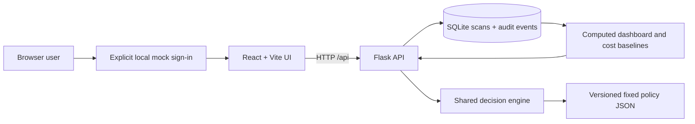
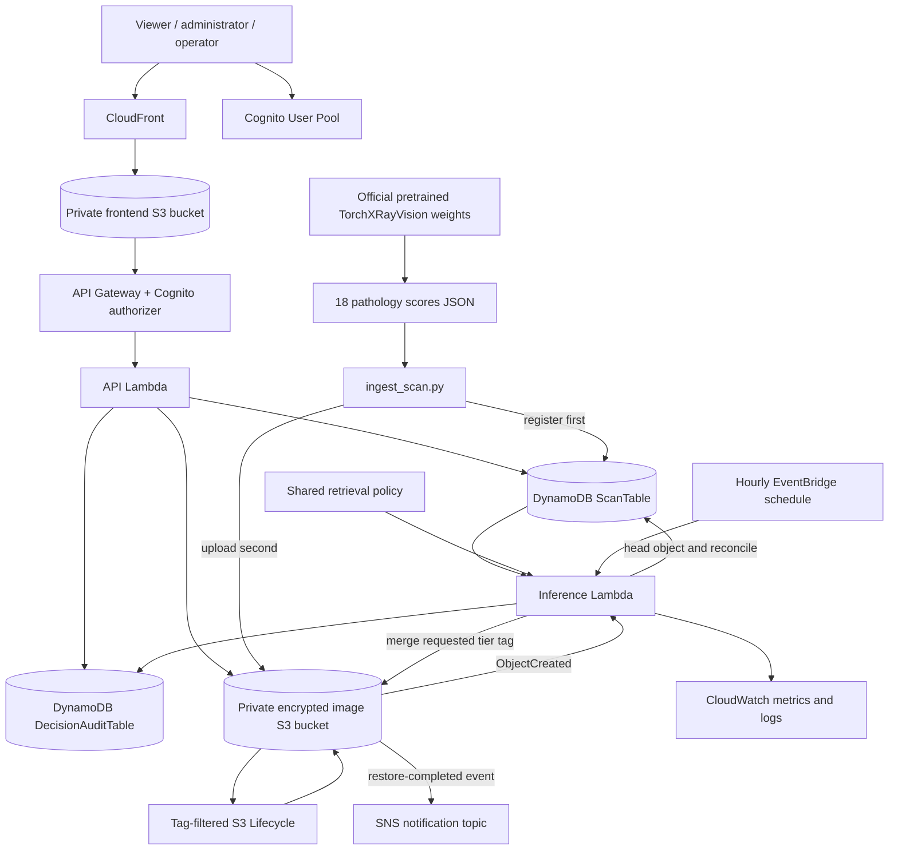

# CloudTierRecommender

## Product description

CloudTierRecommender is an explainable storage placement system for medical image repositories. It recommends one of four Amazon S3 storage classes for each scan: Standard, Standard-IA, Glacier Flexible Retrieval, or Glacier Deep Archive. The product balances storage cost against the probability and operational consequence of retrieving a scan again.

The product separates three concerns that are often mixed together:

1. A published chest X-ray network converts an image into 18 named pathology scores.
2. A versioned, fixed scoring policy combines those scores with non-identifying metadata and access counts to estimate retrieval probability.
3. An explicit cost policy compares every eligible S3 tier and chooses the lowest policy score. Monetary cost and the modeled access-delay penalty remain separate and visible.

No model is trained or fine-tuned by this project. Image feature extraction loads the published TorchXRayVision `densenet121-res224-all` weights directly. The former XGBoost experiment remains only as historical code in `legacy_training.py`; `train.py` deliberately exits so the active workflow cannot accidentally start training.

The system supports two complete execution modes. Local mode uses Flask, SQLite, local mock authentication, and the real shared decision engine. AWS mode uses CloudFront, private S3, Cognito, API Gateway, Lambda, DynamoDB, EventBridge, SNS, and S3 Lifecycle. The application never stores access keys in source. AWS SDKs use the normal credential chain locally and Lambda execution roles in the cloud.

### Product goals

- Give an archive administrator a clear recommendation, retrieval probability, cost breakdown, and explanation for every scan.
- Keep the requested storage tier distinct from the tier observed on the S3 object.
- Require a reason for manual overrides and keep an append-only audit history.
- Support archived-object restore requests and reconcile completion from S3 state.
- Show cost comparisons against simple baseline policies without presenting modeled penalties as an AWS bill.
- Run the entire product locally before an AWS account is connected.

### Users and workflows

| User | Main workflow | Enforcement |
| --- | --- | --- |
| Viewer | Sign in, view dashboard, search scans, inspect explanations and costs | Cognito authenticated read routes in AWS |
| Archive administrator | Request tier overrides and restores | `archive-admin` Cognito group |
| Operator | Run placement and recovery operations | `operator` Cognito group |
| Evaluator | Run local API/UI, test inference, inspect architecture and evidence | Local mode with explicit demo identity |

The normal workflow is:

1. Extract pathology scores from an image with the published model weights.
2. Register metadata and scores in DynamoDB before uploading the object.
3. Upload the image to the private S3 image bucket.
4. The S3 event invokes the inference Lambda.
5. The shared decision engine calculates retrieval probability and per-tier costs.
6. Lambda preserves existing object tags, writes the requested `tier` tag, stores pending placement state, writes an audit event, and emits CloudWatch metrics.
7. S3 Lifecycle performs eligible transitions asynchronously.
8. A scheduled reconciliation invocation reads actual S3 storage and restore state and updates DynamoDB.
9. The dashboard exposes the decision, actual state, cost model, overrides, restore state, and audit events.

### Safety and product boundaries

This is a storage research and demonstration system. It is not a diagnostic tool, PACS replacement, clinical decision support product, or clinically calibrated retrieval predictor. It uses public or synthetic research data and avoids patient names and dates of birth. The fixed retrieval coefficients and access-delay penalties are transparent engineering assumptions that require sensitivity analysis before a research claim or operational rollout.

## Delivered state

| Area | Delivered behavior | Remaining external action |
| --- | --- | --- |
| Frontend | React 18, Vite, Tailwind, Recharts; login, dashboard, search/filter browser, detail, prediction, override, restore, audit, and cost pages | Publish generated `dist/` through the deployment script |
| Local backend | Validated Flask API, SQLite migrations/seeding, computed summaries/costs, audit log, restore simulation | None |
| Cloud API | Cognito-protected routes, group checks, DynamoDB paging contract, real predictions, S3 tagging/restores, audit, summaries, and structured errors | Deploy with AWS credentials |
| Inference | Official pretrained TorchXRayVision weights offline; one shared fixed policy online; no training | Run extraction on the selected project image set |
| AWS mechanism | S3 event inference, safe missing-feature state, tag preservation, Lifecycle rules, scheduled placement/restore reconciliation, metrics, SNS restore event | Deploy and observe live service behavior |
| Infrastructure | One validated SAM/CloudFormation template plus Lambda bundle builders and one PowerShell deployment command | Supply AWS credentials, region, and optional notification email |
| Security | Private encrypted/versioned buckets, CloudFront OAC, Cognito authorizer/groups, scoped SAM policies, no embedded credentials | Create users and assign groups after deployment |

The implementation is complete in code. The only blocker to provisioning and live AWS evidence is an AWS identity with permission to deploy the stack. Scientific validation of the fixed policy remains a research activity rather than an application coding gap.

## Repository map

```text
CloudTierRecommender/
├── README.md
├── architecture/
│   ├── PRODUCT_AND_IMPLEMENTATION.md   This canonical implementation record
│   ├── README.md                       Earlier architecture notes
│   └── decisions.md                    Architecture decision records
├── aws/
│   ├── template.yaml                   Deployable SAM/CloudFormation stack
│   ├── deploy.ps1                      Package, deploy, build, publish
│   ├── ingest_scan.py                  Register features, then upload image
│   ├── lambda/api_handler/             Cloud REST API Lambda
│   ├── lambda/tier_inference/          S3 inference and scheduled reconciler
│   └── iam_policies/                   Reviewable policy references
├── src/
│   ├── backend/                        Flask + SQLite local application
│   ├── frontend/                       React + Vite browser application
│   └── ml_model/                       Pretrained extraction and shared policy
├── tests/                              Local API, cloud handlers, and policy tests
├── dataset/                            Data scripts and excluded local data
├── results/                            Saved historical experiment artifacts
└── docs/                               Course reports
```

Generated frontend builds, Lambda bundles, local databases, credentials, model checkpoints, and image data are ignored by Git.

## Architecture

### Local end-to-end mode



Local API failures remain visible errors. Mock API data is used only when `VITE_USE_MOCK_API=true`; the client never silently converts a live failure into a successful mock mutation.

### AWS deployment architecture



### Ingest and placement sequence

```mermaid
sequenceDiagram
    autonumber
    participant O as Operator
    participant X as Pretrained extractor
    participant D as DynamoDB
    participant S as S3
    participant L as Inference Lambda
    participant A as Audit table
    participant R as Scheduled reconciler
    O->>X: Extract pathology scores from image
    X-->>O: JSON with weight name and source SHA-256
    O->>D: Register opaque scan ID, object location, metadata, scores
    O->>S: Upload object
    S->>L: ObjectCreated event
    L->>D: Read registered features
    alt Features missing
        L->>D: BLOCKED_MISSING_FEATURES; requested STANDARD
        L->>A: Record blocked decision
    else Features ready
        L->>L: Score retrieval and compare tier policy costs
        L->>S: Preserve tags and set requested tier tag
        L->>D: Store recommendation and PENDING_TRANSITION
        L->>A: Append versioned recommendation
    end
    R->>S: Read actual storage class and restore header
    R->>D: Store observed tier and completion state
    R->>A: Append reconciliation event
```

## Main contracts

### REST API

| Method | Route | Behavior |
| --- | --- | --- |
| `GET` | `/api/health` | Local readiness, execution mode, auth mode, policy version |
| `GET` | `/api/scans?page=&limit=&tier=&search=` | Validated, bounded, filtered scan page |
| `GET` | `/api/scans/{id}` | Metadata, state, explanation, per-tier costs, audit history |
| `POST` | `/api/scans/{id}/predict` | Run and persist the shared inference-only decision |
| `POST` | `/api/scans/{id}/tier` | Validate tier and required reason, then request/apply override |
| `POST` | `/api/scans/{id}/restore` | Submit S3 restore or return `NOT_REQUIRED` |
| `GET` | `/api/dashboard/summary` | Compute tier distribution, cost, and wrongly archived metrics |
| `GET` | `/api/costs?horizon=` | Compute four baseline/policy simulations for a bounded horizon |

Errors use `{error: {code, message, request_id}}`. Local mode applies tier and restore changes immediately to SQLite. AWS mode keeps tier changes pending until the scheduled reconciler sees the requested S3 storage class. A move to a colder class uses a Lifecycle tag; a move to a more accessible class uses a same-key S3 copy. Archived objects must complete restoration before the copy, and repeat restore requests in the pending state return the existing request.

### State model

- `scan_id` is an opaque SHA-256-derived identifier in AWS; bucket and full key are separate fields.
- `requested_tier` expresses intent; `current_tier`/`observed_tier` express storage state.
- `decision_status` distinguishes ready, blocked, pending, locally applied, and AWS-applied decisions.
- The scan table holds the latest state. The audit table stores immutable events under `(scan_id, event_id)`.
- Pathology scores are precomputed before upload so the Lambda package stays small and never loads PyTorch.
- Existing S3 tags are merged rather than overwritten.

### Cost policy

For each tier, the engine calculates storage cost, archive metadata overhead, transition requests, expected retrieval charges, and a separate expected access-delay penalty. It respects minimum billable object size and minimum storage duration. Objects below the S3 Lifecycle transition threshold remain in Standard. The chosen tier minimizes `monetary_cost + access_delay_penalty`, while the API exposes both parts individually.

The checked-in price snapshot is versioned and dated. It is a planning model, not a billing quote. Prices and policy coefficients must be reviewed before a real deployment.

## Run locally

Use Python 3.11–3.13 and Node.js 20 or newer.

```powershell
python -m venv .venv
.\.venv\Scripts\Activate.ps1
pip install -r src/backend/requirements.txt
pip install -r src/ml_model/requirements.txt
python src/backend/app.py
```

In another terminal:

```powershell
cd src/frontend
npm ci
npm start
```

Open `http://127.0.0.1:5173` and use the displayed local demo login. The UI talks to the real local API by default. To use static frontend fixtures deliberately, copy `.env.example` to `.env.local` and set `VITE_USE_MOCK_API=true`.

## Run published-weight inference

```powershell
python src/ml_model/extract_pretrained_features.py path\to\xray.png --output temp\features.json
python src/ml_model/predict.py --features temp\features.json --size-bytes 15728640
```

The first extraction downloads the official TorchXRayVision weights to its normal user cache. The output records the source image SHA-256, model weight name, and 18 scores. The image used for the runtime smoke test was a repository chart and therefore verifies software compatibility only; it is not evidence of medical validity.

## Deploy after credentials are supplied

Configure an AWS CLI profile or environment-backed session, then run:

```powershell
.\aws\deploy.ps1 -Region us-east-1 -StackName smart-storage-tier -NotificationEmail you@example.com
```

The script verifies the caller, creates/reuses a regional artifact bucket, builds both Lambda source bundles, packages and deploys the SAM stack, writes an ignored Vite production environment file from stack outputs, builds the frontend, synchronizes `dist/` to the private frontend bucket, and invalidates CloudFront.

After deployment:

1. Confirm any optional SNS email subscription.
2. Create Cognito users and assign `viewer`, `archive-admin`, or `operator` groups.
3. Extract features for a public test X-ray.
4. Run `aws/ingest_scan.py` with the stack’s image bucket and scan table outputs.
5. Observe the DynamoDB decision, preserved S3 tags, CloudWatch metric, Lifecycle transition state, and audit row.
6. Request a restore in the UI and observe scheduled reconciliation and notification behavior.

No access key belongs in `.env`, the repository, the browser build, or a Lambda environment variable.

## Validation completed on 21 September 2026

- 16 Python unit/integration tests pass across the policy engine, Flask API, cloud API Lambda, and inference Lambda.
- The production Vite build completes and `npm audit` reports zero vulnerabilities.
- Both Lambda source bundle builders complete.
- `cfn-lint` accepts `aws/template.yaml` with no findings.
- The official `densenet121-res224-all` checkpoint downloaded and produced 18 pathology scores under the installed modern PyTorch runtime.
- A browser smoke test completed sign-in, live dashboard loading, scan browsing, scan detail, prediction, override, restore, audit display, and cost comparison against the running Flask API.
- Python bytecode compilation and Git whitespace checks pass.

AWS resource creation and live cloud integration were intentionally not attempted without credentials.

## Implementation plan and status

### Completed: inference and policy

- [x] Disable project model training and keep the old experiment clearly marked as legacy.
- [x] Load published pretrained chest X-ray weights directly.
- [x] Produce named pathology scores with source provenance.
- [x] Share one pure-Python feature, probability, and cost policy across local and AWS code.
- [x] Version weights, price assumptions, and policy output.
- [x] Separate monetary cost from modeled access delay.

### Completed: backend and state

- [x] Implement the full local REST contract with validation and consistent errors.
- [x] Add SQLite migration, deterministic seed behavior, filtering, paging, summaries, costs, overrides, restores, and audit events.
- [x] Implement the equivalent cloud routes without placeholder responses.
- [x] Enforce Cognito groups on cloud mutations.
- [x] Keep requested and observed placement state distinct.
- [x] Add immutable cloud audit events.

### Completed: frontend

- [x] Connect every screen to the API contract.
- [x] Show live errors rather than silently falling back to mock success.
- [x] Show execution mode, loading/error states, decision status, restore status, audit history, and cost categories.
- [x] Implement search, tier filters, deep links, prediction, required override reason, and restore actions.
- [x] Migrate the build from Create React App to Vite and remove audited dependency findings.

### Completed: AWS implementation

- [x] Define private encrypted/versioned image and frontend buckets.
- [x] Define DynamoDB state and audit tables with point-in-time recovery.
- [x] Define Cognito pool/client/groups and API Gateway authorizer.
- [x] Define API and inference Lambdas with scoped permissions.
- [x] Define tag-filtered Lifecycle rules, CloudFront OAC, SNS, EventBridge, logs, and metrics integration.
- [x] Add safe missing-feature behavior, stable IDs, tag merging, restore requests, and scheduled reconciliation.
- [x] Add deterministic build, ingest, and deployment scripts.

### Credential-gated deployment checklist

- [ ] Configure AWS credentials for the intended account and region.
- [ ] Create a low AWS Budget alert before ingesting data.
- [ ] Run `aws/deploy.ps1` and record stack outputs.
- [ ] Create Cognito demo users and group assignments.
- [ ] Ingest a small public-data fixture and capture live transition/restore evidence.
- [ ] Review incurred cost and delete non-retained test resources after the demonstration.

### Separate research validation work

This work does not block the application from running, but it does block strong scientific claims: validate the retrieval proxy, run sensitivity sweeps, document dataset checksums/splits, compare fixed-policy baselines, and report uncertainty. Historical metrics under `results/` are prototype artifacts and should not be presented as clinical validation.

## Decisions recorded in this implementation

1. Published weights are consumed as-is; the application never trains a model.
2. Offline extraction keeps PyTorch out of Lambda and records image/weight provenance.
3. Local and cloud modes are explicit; there is no silent AWS-to-SQLite or live-to-mock fallback.
4. Stable opaque IDs derive from bucket plus complete key, avoiding basename collisions and key disclosure.
5. S3 tags express requested placement; reconciliation confirms physical placement.
6. Manual decisions and automated decisions create append-only audit events.
7. AWS credentials come later through the standard SDK chain and IAM roles.
8. One SAM template is the source of truth for the deployable cloud stack.
9. Vite is the frontend build system; generated cloud configuration stays ignored.
10. Standard-IA Lifecycle transition begins at 30 days to respect S3 transition constraints.
11. An operator move to a more accessible tier uses S3 CopyObject after any required restore; ObjectCreated replay cannot overwrite the pending manual override.

## Maintenance rule

Update this document and `architecture/decisions.md` whenever implementation behavior changes. After each update, copy this file to the Obsidian vault at `Subhro-projects/CloudTierRecommender/README.md` and verify that both files have the same SHA-256 hash.
