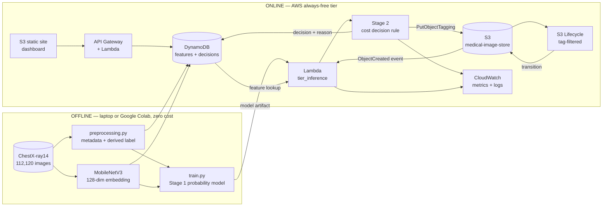
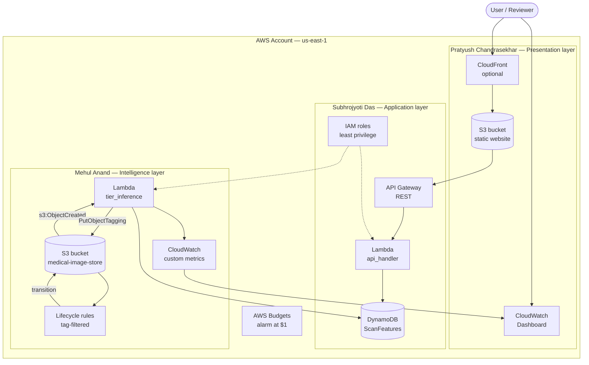
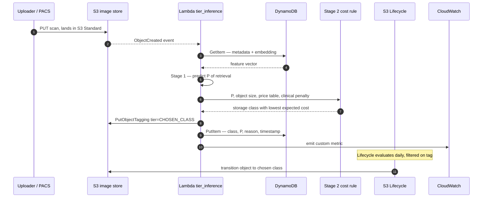
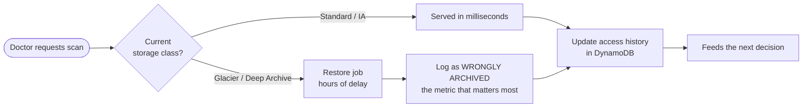
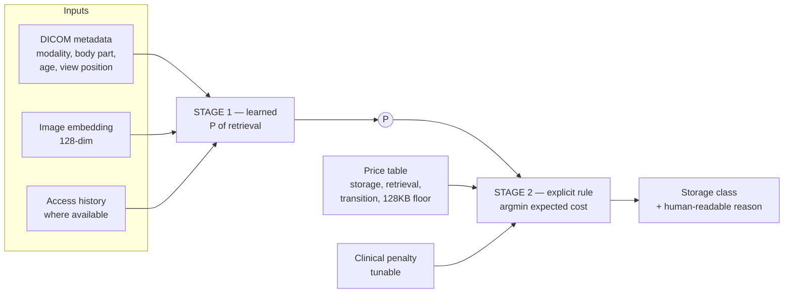
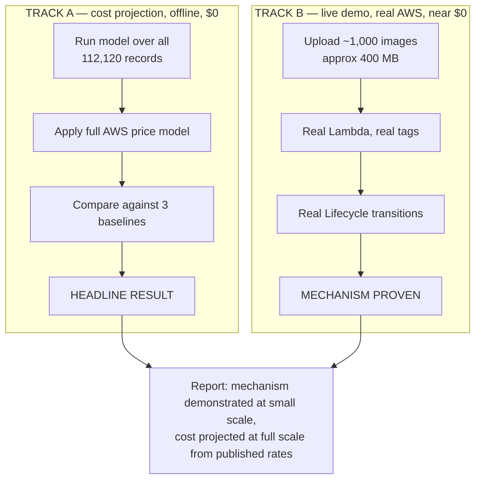
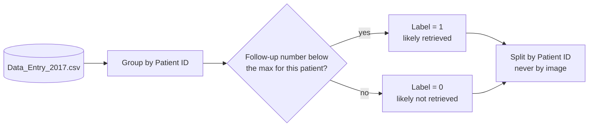

# architecture/

System, deployment and workflow design for the Smart Storage Tier Recommender.

Diagrams are written as **Mermaid** rather than exported images, so they live in version control,
diff properly in pull requests, and render natively on GitHub. Export a PNG only when the report
needs one — the Mermaid source stays the master copy.

Decisions and rejected alternatives are recorded in [`decisions.md`](decisions.md).

---

## 1. The idea in one paragraph

A scan arrives and lands in S3 Standard. An S3 event triggers a Lambda, which pulls that scan's
features from DynamoDB — DICOM-style metadata plus a precomputed image embedding — and predicts
the probability that the scan will ever be retrieved again. A cost rule then converts that
probability into the storage class with the lowest expected total cost, weighting a wrongly
archived scan far more heavily than a slightly higher bill. The Lambda writes the chosen class as
an S3 object tag; a tag-filtered Lifecycle rule performs the actual transition. Every decision,
with its probability and reason, is written to DynamoDB so the dashboard can explain *why* a scan
ended up where it did.

The heavy deep learning work happens **offline and once**. Only a small classifier runs in Lambda.

---

## 2. System architecture

Logical view — what each component is responsible for.



### Responsibilities

| Component | Responsible for | Deliberately not responsible for |
| --- | --- | --- |
| `preprocessing.py` | Parsing metadata, deriving the retrieval label, patient-level splits | Any AWS interaction |
| Embedding extractor | Turning each image into a 128-dim vector, once | Running at request time |
| `train.py` | Learning `P(retrieved again)` | Choosing a storage class |
| Stage 2 cost rule | Turning a probability into a storage class | Learning anything |
| `tier_inference` Lambda | Orchestrating lookup, prediction, tagging, logging | Performing the transition |
| S3 Lifecycle | Physically moving objects between classes | Deciding which class |
| DynamoDB | Features, access history, decisions with reasons | Storing images |
| Dashboard | Showing and explaining decisions | Talking to AWS directly |

The split between the Lambda (**decides**) and Lifecycle (**enforces**) is deliberate — see
[ADR-003](decisions.md#adr-003--tag-based-lifecycle-rules-over-direct-api-calls).

---

## 3. AWS deployment architecture

Deployment view, with service ownership marked for the individual-defence requirement.



### Service inventory

| Service | Used for | Free-tier position | Owner |
| --- | --- | --- | --- |
| S3 | Image store + static site hosting | 5 GB Standard, 20k GET, 2k PUT/month | Mehul, Pratyush |
| Lambda | Inference and API | 1M requests + 400k GB-s/month, **always free** | Mehul, Subhrojyoti |
| DynamoDB | Features, decisions | 25 GB + 25 RCU/WCU, **always free** | Subhrojyoti |
| API Gateway | REST endpoint | Consumes credits after free allowance | Subhrojyoti |
| **Cognito** | **User sign-in, JWT, role-based access** | **Generous monthly-active-user tier** | Subhrojyoti |
| **SNS** | **Restore complete, wrongly-archived, failures, budget** | **1M publishes + 1,000 emails free** | Mehul |
| CloudWatch | Logs, custom metrics, dashboard | 10 custom metrics, 5 GB logs free | Mehul, Pratyush |
| IAM | Least-privilege roles | Free | Subhrojyoti |
| AWS Budgets | Spend alarm | Free | All |
| CloudFront | CDN for the dashboard | Always-free allowance | Pratyush |

**No EC2. No RDS.** Both carry idle cost, and a forgotten instance is the most common way a
student project drains its credits. See [ADR-001](decisions.md#adr-001--serverless-only-no-ec2).

**Cognito and SNS were added on 31 July 2026** after reviewing the design against the course
guidelines, which require the AWS diagram to show authentication and notifications. Both filled real
gaps: IAM governs services but does not authenticate a clinician, and nothing previously told anyone
when a scan had been wrongly archived. See
[ADR-009](decisions.md#adr-009--add-amazon-cognito-and-amazon-sns).

### Rendered diagrams for the report

Mermaid is the master reference, but the report needs print-quality images:

```bash
python architecture/make_diagrams.py
```

Writes `AWS_Architecture.png` and `System_Architecture.png` at 300 DPI. Regenerate them whenever the
design changes — do not edit the PNGs by hand.

---

## 4. Workflow — a scan's journey

Sequence view, ingest through to physical transition.



### Retrieval path



The **wrongly archived rate** is the headline safety metric. A cost saving that comes with a high
wrongly-archived rate is not a success, and the report must present the two together.

---

## 5. The two-stage model

The core design choice. Full rationale in
[ADR-005](decisions.md#adr-005--two-stage-model-instead-of-a-four-class-classifier).



Expected cost for a candidate class:

```
expected_cost(class) =  storage_cost(class, billable_size, horizon)
                      + P * retrieval_cost(class, size)
                      + P * clinical_penalty(class)
                      + transition_cost(class)
```

where `billable_size = max(object_size, 128KB) + 40KB` for Glacier classes.

Keeping Stage 2 as an explicit rule buys three things: decisions are explainable at review, the
clinical penalty can be re-tuned and every result regenerated **without retraining**, and the
asymmetry between mistake types is visible in the code rather than buried in a loss function.

---

## 6. Cost model

Modelling this properly is the project's most defensible contribution — the Khan et al. paper the
team reviewed explicitly omitted transition and early-deletion costs, and we listed that as one of
its limitations.

Every term below must appear in `src/ml_model/evaluate.py`:

| Term | Detail |
| --- | --- |
| Storage | Per GB-month, per class |
| Minimum billable size | Objects under **128 KB billed as 128 KB** in IA and Glacier classes |
| Glacier metadata overhead | **+40 KB per object** — 8 KB at Standard rates, 32 KB at archive rates |
| Transition requests | Charged per 1,000 lifecycle transitions |
| Retrieval | Per GB **and** per request; Deep Archive also charges per 1,000 restore requests |
| Minimum duration | Standard-IA 30 d, Glacier Flexible 90 d, Deep Archive 180 d — early deletion is charged pro-rata for the remainder |

Published us-east-1 rates used as the baseline (re-verify before final submission — prices change):

| Class | $/GB/month | Min duration | Min billable | Retrieval |
| --- | --- | --- | --- | --- |
| S3 Standard | 0.023 | — | — | free |
| S3 Standard-IA | ~0.0125 | 30 d | 128 KB | per-GB fee |
| Glacier Flexible Retrieval | 0.0036 | 90 d | 128 KB | $0.01/GB standard, bulk free |
| Glacier Deep Archive | 0.00099 | 180 d | 128 KB | $0.02/GB + $0.10 per 1,000 requests |

### Baselines to beat

| Baseline | Why it is included |
| --- | --- |
| Everything in S3 Standard | The expensive status quo — shows the headline saving |
| Age-based rule, e.g. archive after 90 days | What hospitals actually do today |
| S3 Intelligent-Tiering | AWS's own answer — the honest competitor, and the one that matters |

Beating the age rule is the minimum bar. Beating Intelligent-Tiering is the real claim, and it
should be winnable, because Intelligent-Tiering cannot see clinical metadata.

---

## 7. Evaluation strategy

Two tracks, because we have no budget and cannot store 45 GB.



This is standard practice and must be **stated plainly** in the report, not glossed over. Khan et
al. did the same thing with Google Cloud prices on simulated data; we do it better by including the
cost terms they left out.

---

## 8. Dataset

**NIH ChestX-ray14** — chosen because it is fully open with no registration, credentialing or data
use agreement. See [ADR-006](decisions.md#adr-006--nih-chestx-ray14-as-the-dataset) and
[`../dataset/README.md`](../dataset/README.md).

The label is derived from the `Follow-up #` column: if a scan's follow-up number is lower than the
maximum for that patient, a later study exists, so the earlier scan was very likely retrieved for
comparison.



**Two constraints that must be stated in the report:**

1. **No timestamps.** ChestX-ray14 records follow-up *ordering*, not dates. Use Patient Age deltas
   as a coarse interval proxy and be explicit that intervals are approximate.
2. **Leakage boundary.** This scan's own `Follow-up #` is a legitimate feature — it is known at
   ingest. The *existence of a later scan* is the label. Do not blur the two, and always split by
   `Patient ID`, never by image.

---

## 9. Open items

- [ ] Confirm AWS account creation date — before or after 15 July 2025 decides the free-tier regime
- [ ] Set the AWS Budgets alarm at $1 **before** creating any other resource
- [ ] Fix the DynamoDB partition key design and confirm access patterns
- [ ] Agree the API contract between Pratyush Chandrasekhar and Subhrojyoti Das
- [ ] Choose the clinical penalty values and the range for the sensitivity sweep
- [ ] Decide whether CloudFront is included or the S3 static site is served directly
- [ ] Export PNG versions of these diagrams for the report once stable

---

## 10. How to render these diagrams

GitHub renders Mermaid automatically in Markdown. For a PNG to paste into the report:

- [mermaid.live](https://mermaid.live) — paste the source, export PNG or SVG
- VS Code with the *Markdown Preview Mermaid Support* extension
- `mmdc` (Mermaid CLI) if you want it scripted

Export at 300 DPI or higher. Diagrams that look fine on screen turn to mush when printed.
Keep the Mermaid source here as the master; the PNG is a build artifact.
